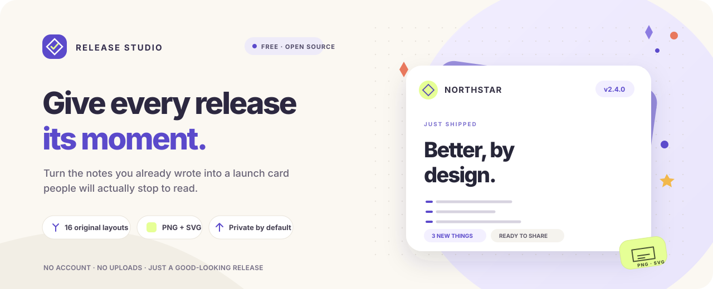
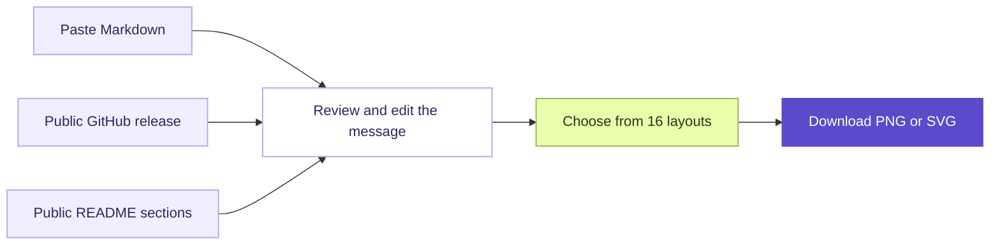

<div align="center">
  
  <p>
    <a href="https://hakanbabus.github.io/release-studio/"><strong>Open the live studio ↗</strong></a>
    &nbsp;·&nbsp;
    <a href="README.tr.md">Türkçe</a>
    &nbsp;·&nbsp;
    <a href="CONTRIBUTING.md">Contribute</a>
  </p>
  <p>
    <a href="https://github.com/HakanBabus/release-studio/actions/workflows/deploy-pages.yml"></a>
    <a href="LICENSE"></a>
  </p>
</div>

<p align="center"><strong>Turn release notes into polished, shareable launch cards.</strong><br />Paste Markdown or import a public GitHub release, then export a 1200 × 630 PNG or SVG.</p>

<p align="center"><strong>16 original layouts</strong> · Editable highlights · No account · Browser-based exports</p>

<p align="center">
  <a href="#how-it-works">How it works</a> ·
  <a href="#import-from-github">GitHub import</a> ·
  <a href="#privacy-and-exports">Privacy</a> ·
  <a href="#run-locally">Run locally</a>
</p>

## Highlights

- **Make it yours:** choose from 16 distinctly composed card layouts, then adjust the theme and accent color.
- **Start from what you have:** paste Markdown, import a public GitHub release, or pick sections from a repository README.
- **Keep control of the copy:** edit the project name, version, title, summary, and up to three highlights before exporting.
- **Export on your device:** download a crisp PNG or SVG without uploading release notes to a Release Studio server.
- **Get started instantly:** no account, install, build step, or runtime dependency is required.

## How it works



## Create your first card

1. **Choose a source.** Paste release notes, fetch a public GitHub URL, or click **Try an example**.
2. **Shape the message.** Review the title, summary, version, and up to three highlights; edit anything that needs a tweak.
3. **Choose a look.** Browse the 16 layouts, switch between light and dark, and set an accent color.
4. **Share it.** Download a **PNG** or **SVG** and post it wherever your release lives.

## Import from GitHub

Paste one of these public URLs into the **GitHub URL** tab:

| URL | What it imports |
| --- | --- |
| `https://github.com/owner/repo` | The latest published release; if none exists, the repository README |
| `https://github.com/owner/repo/releases/latest` | The latest published release |
| `https://github.com/owner/repo/releases/tag/v1.2.3` | A specific release |
| `https://api.github.com/repos/owner/repo/releases/latest` | The latest release through GitHub's API |
| `https://api.github.com/repos/owner/repo/releases/tags/v1.2.3` | A specific release through GitHub's API |

Release and README requests are sent from your browser to GitHub only after you ask to fetch them. If a repository has no published release, Release Studio offers its README sections so you can choose up to three. The selected text stays editable in the Markdown editor. Use **Pick from README sections** whenever you want to start from a README directly. README files over **1 MB** are not imported.

Private repositories and draft releases are not supported. GitHub may rate-limit anonymous requests; if you hit a limit, wait for the time shown or paste the notes instead. No personal access token is needed or accepted.

The parser uses the first non-section heading as the title, the first paragraph as the summary, and the first three ordered or unordered list items as highlights. It recognizes versions such as `v1.4.0` in a title. Additional list items remain in the source notes. If there is no title, it uses “Release update”.

Markdown is treated as text. Headings, lists, links, emphasis, inline code, and simple HTML tags are handled for this card format; arbitrary HTML is not rendered.

## Privacy and exports

- Pasted notes and imported content stay in the current browser tab. Release Studio does not upload or save them in local storage.
- When you explicitly import a GitHub URL, your browser contacts `api.github.com` for public release or README content. The request goes directly from your network to GitHub; there is no Release Studio server.
- The app loads no remote fonts, scripts, or images.
- PNG and SVG files are rendered locally at **1200 × 630 px**.
- PNG export needs browser support for SVG images and Canvas. If PNG rendering is unavailable, SVG export remains an option.

## Run locally

Release Studio is plain HTML, CSS, and JavaScript. No package install or build step is needed. Open `site/index.html` directly, or serve the `site/` folder from the repository root:

```powershell
python -m http.server 8000 --directory site
```

Then visit [http://localhost:8000](http://localhost:8000).

## Deploy with GitHub Pages

The included workflow publishes `site/` to GitHub Pages after each push to `main`. On a fork, set **Settings → Pages → Build and deployment → Source** to **GitHub Actions** once. GitHub shows deployment progress in the **Actions** tab and the published address under **Settings → Pages**.

## Contributing

Bug reports, accessibility feedback, and focused improvements are welcome. Start with [CONTRIBUTING.md](CONTRIBUTING.md); for security reports, see [SECURITY.md](SECURITY.md).

## License

Release Studio is available under the [MIT License](LICENSE).
