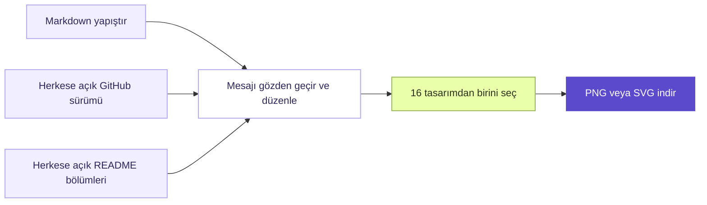

<div align="center">
  
  <p>
    <a href="https://hakanbabus.github.io/release-studio/"><strong>Canlı stüdyoyu aç ↗</strong></a>
    &nbsp;·&nbsp;
    <a href="README.md">English</a>
    &nbsp;·&nbsp;
    <a href="CONTRIBUTING.md">Katkıda bulun</a>
  </p>
  <p>
    <a href="https://github.com/HakanBabus/release-studio/actions/workflows/deploy-pages.yml"></a>
    <a href="LICENSE"></a>
  </p>
</div>

<p align="center"><strong>Sürüm notlarını paylaşmaya değer lansman kartlarına dönüştür.</strong><br />Markdown yapıştır veya herkese açık bir GitHub sürümü içe aktar; 1200 × 630 PNG ya da SVG indir.</p>

<p align="center"><strong>16 özgün tasarım</strong> · Düzenlenebilir öne çıkanlar · Hesap gerekmez · Tarayıcıda dışa aktarım</p>

<p align="center">
  <a href="#nasıl-çalışır">Nasıl çalışır?</a> ·
  <a href="#githubdan-içe-aktarma">GitHub'dan içe aktarma</a> ·
  <a href="#gizlilik-ve-dışa-aktarma">Gizlilik</a> ·
  <a href="#yerel-çalıştırma">Yerel çalıştırma</a>
</p>

## Öne çıkanlar

- **Kendine göre tasarla:** birbirinden farklı 16 kart düzeninden birini seç; temayı ve vurgu rengini ayarla.
- **Elindekilerle başla:** Markdown yapıştır, herkese açık GitHub sürümünü içe aktar veya depo README'sinden bölümler seç.
- **Metin sende kalsın:** dışa aktarmadan önce proje adını, sürümü, başlığı, özeti ve en fazla üç öne çıkan maddeyi düzenle.
- **Cihazında dışa aktar:** sürüm notlarını Release Studio sunucusuna yüklemeden PNG veya SVG indir.
- **Hemen kullan:** hesap, kurulum, derleme adımı veya çalışma zamanı bağımlılığı gerekmez.

## Nasıl çalışır?



## İlk kartını oluştur

1. **Kaynak seç.** Sürüm notlarını yapıştır, herkese açık bir GitHub adresi getir veya **Try an example** düğmesine bas.
2. **Mesajı düzenle.** Başlığı, özeti, sürümü ve en fazla üç öne çıkan maddeyi kontrol et; istediğin yeri değiştir.
3. **Görünümü seç.** 16 tasarıma göz at, açık/koyu temayı değiştir ve vurgu rengini ayarla.
4. **Paylaş.** **PNG** veya **SVG** indir ve sürümünü duyurduğun yerde paylaş.

## GitHub'dan içe aktarma

**GitHub URL** sekmesine aşağıdaki herkese açık adreslerden birini yapıştır:

| Adres | İçe aktardığı içerik |
| --- | --- |
| `https://github.com/kullanici/depo` | Son yayımlanmış sürüm; yoksa depo README'si |
| `https://github.com/kullanici/depo/releases/latest` | Son yayımlanmış sürüm |
| `https://github.com/kullanici/depo/releases/tag/v1.2.3` | Belirli bir sürüm |
| `https://api.github.com/repos/kullanici/depo/releases/latest` | GitHub API üzerinden son sürüm |
| `https://api.github.com/repos/kullanici/depo/releases/tags/v1.2.3` | GitHub API üzerinden belirli bir sürüm |

Sürüm ve README içeriği için istekleri yalnızca **Fetch notes** dediğinde tarayıcın doğrudan GitHub'a gönderir. Depoda yayımlanmış sürüm yoksa Release Studio README bölümlerini sunar; en fazla üçünü seçebilirsin. Seçtiklerin Markdown düzenleyicisinde kalır ve düzenlenebilir. README'den başlamak istediğinde **Pick from README sections** düğmesini de kullanabilirsin. **1 MB** üzerindeki README dosyaları içe aktarılmaz.

Özel depolar ve taslak sürümler desteklenmez. GitHub anonim isteklere hız sınırı uygulayabilir; sınıra takılırsan ekrandaki süre kadar bekleyebilir veya notları kendin yapıştırabilirsin. Kişisel erişim anahtarı gerekmez ve kabul edilmez.

Ayrıştırıcı bölüm başlığı olmayan ilk Markdown başlığını kart başlığı, ilk paragrafı özet, ilk üç sıralı ya da sırasız liste maddesini öne çıkanlar olarak kullanır. Başlıkta `v1.4.0` gibi bir sürüm bulursa bunu sürüm alanına alır. Diğer liste maddeleri kaynak notlarında kalır. Başlık yoksa “Release update” kullanılır.

Markdown bu kart biçimi için metin olarak işlenir. Başlıklar, listeler, bağlantılar, biçimlendirme, satır içi kod ve basit HTML etiketleri ele alınır; keyfî HTML görüntülenmez.

## Gizlilik ve dışa aktarma

- Yapıştırdığın notlar ve içe aktardığın içerik açık tarayıcı sekmesinde kalır. Release Studio bunları sunucuya yüklemez veya yerel depolamaya kaydetmez.
- GitHub adresini özellikle içe aktardığında tarayıcın herkese açık sürüm ya da README içeriği için `api.github.com` adresine bağlanır. İstek kendi ağından GitHub'a gider; arada Release Studio sunucusu yoktur.
- Uygulama uzaktan font, betik veya görsel yüklemez.
- PNG ve SVG dosyaları tarayıcıda **1200 × 630 piksel** hazırlanır.
- PNG dışa aktarımı için tarayıcının SVG görseli ve Canvas desteği gerekir. PNG oluşturulamazsa SVG indirme seçeneği kullanılabilir.

## Yerel çalıştırma

Release Studio düz HTML, CSS ve JavaScript'ten oluşur. Paket kurmaya veya derlemeye gerek yok. `site/index.html` dosyasını doğrudan açabilir veya depo kökünde `site/` klasörünü sunabilirsin:

```powershell
python -m http.server 8000 --directory site
```

Ardından [http://localhost:8000](http://localhost:8000) adresine git.

## GitHub Pages ile yayımla

Depodaki workflow, `main` dalına her gönderimden sonra `site/` klasörünü GitHub Pages'te yayımlar. Kendi fork'unda ilk kez **Settings → Pages → Build and deployment → Source** ayarını **GitHub Actions** yap. Dağıtım ilerlemesini **Actions** sekmesinde, yayımlanan adresi **Settings → Pages** bölümünde görebilirsin.

## Katkı

Hata bildirimleri, erişilebilirlik geri bildirimleri ve odaklı iyileştirmeler memnuniyetle karşılanır. Başlamadan önce [CONTRIBUTING.md](CONTRIBUTING.md) dosyasını, güvenlik bildirimi için [SECURITY.md](SECURITY.md) dosyasını incele.

## Lisans

Release Studio [MIT Lisansı](LICENSE) ile sunulur.
